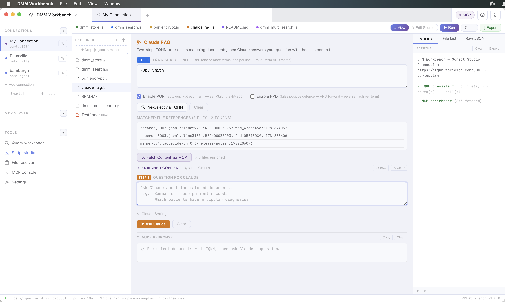
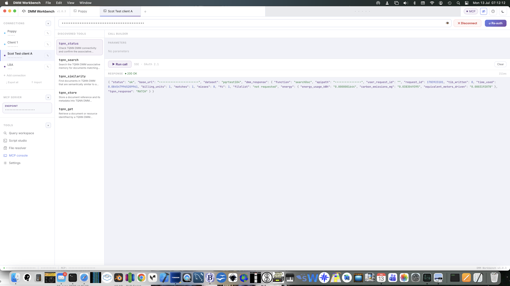

# DMM Workbench

**A multi-connection developer tool for the TQNN Distributed Memory Manager (DMM).**

DMM Workbench is a desktop IDE for building against, testing, and demonstrating **TQNN DMM** appliances — associative memory engines that store meaning rather than files. It bundles a query workspace, a script studio for building interactive HTML/JS panels against the DMM API, a Model Context Protocol (MCP) console for talking to `dmm-mcp-server`, and a resolver-aware file browser, all wrapped around a multi-profile connection manager.

Built by [Toridion Ltd](https://toridion.com), Scarborough, North Yorkshire.



---

## Contents

- [What is DMM Workbench?](#what-is-dmm-workbench)
- [Installation](#installation)
- [Getting started](#getting-started)
- [Connection manager](#connection-manager)
- [Query workspace](#query-workspace)
- [Script studio](#script-studio)
- [File resolver](#file-resolver--resolver-architecture)
- [MCP console](#mcp-console)
- [Settings](#settings)
- [Security notes](#security-notes)
- [Version](#version)
- [Changelog](#changelog)
- [License](#license)

---

## What is DMM Workbench?

TQNN DMM is a deterministic, write-time-encoded associative memory engine — content-addressable retrieval without index structures, in the spirit of Kanerva's Sparse Distributed Memory. DMM Workbench is the tool you point at a running DMM appliance (or managed cloud instance) to:

- **Store and query** documents against one or more DMM connections side by side
- **Prototype and export** self-contained HTML/JS demo panels (Script Studio)
- **Drive TQNN's MCP server** directly — discover tools, build calls, inspect JSON-RPC responses (MCP Console)
- **Resolve DMM filereferences** back to their underlying storage via the resolver layer (File Resolver)
- **Chain TQNN pre-selection into Claude** for a two-step retrieval-augmented workflow (Claude RAG panel, inside Script Studio)

It's built on Electron, so it runs as a native desktop app on macOS (with Windows/Linux builds depending on what's published on the [Releases](https://github.com/forshaws/dmm-workbench/releases) page).

---

## Installation

1. Grab the latest build from the [Releases](https://github.com/forshaws/dmm-workbench/releases) page for your platform.
2. **macOS:** open the `.dmg`, drag **DMM Workbench** into `/Applications`.
   - Because the app isn't notarised through the Mac App Store, the first launch may be blocked by Gatekeeper ("DMM Workbench can't be opened because it is from an unidentified developer"). Right-click the app → **Open** → **Open** again to bypass this once, or run:
     ```bash
     xattr -d com.apple.quarantine /Applications/DMM\ Workbench.app
     ```
3. **Windows/Linux:** run the installer / AppImage as published in the release. SmartScreen or your distro's unsigned-binary warning may appear for the same reason as above.
4. Launch the app. You'll land on the home screen with a single **+** tile until you add your first connection.

No separate runtime is required — everything (including the crypto used for PQR hashing) runs inside the Electron shell.

---

## Getting started

1. **Add a connection** — click **+ Add connection** in the sidebar (or the **+** tile on the home screen). You'll need:
   - A **Base URL** for the DMM appliance (e.g. `https://tqnn.example.com:8081`)
   - A **tqnnAPIKEY** / **tqnnAPISECRET** pair
   - Optionally a **default dataset** name and a colour tag for the sidebar dot
2. Click the connection tile to open a **Query workspace** tab against it. The status bar at the bottom always shows which connection, dataset, and MCP endpoint are currently active.
3. If you're working with an MCP-enabled appliance, connect it separately in **MCP console** (see below) — the DMM connection and the MCP connection are independent and can point at different things.

---

## Connection manager

The sidebar's **Connections** section lists every saved DMM profile. Each profile stores:

| Field | Notes |
|---|---|
| Name | Free text label shown in the sidebar and tab bar |
| Base URL | No trailing slash; include the port if the appliance needs one |
| API Key / API Secret | Sent as `tqnnAPIKEY` / `tqnnAPISECRET` on every request |
| Default dataset | Optional — pre-fills the dataset field across zones |
| Colour | Visual tag for the sidebar status dot |

- Clicking a tile activates that connection **and** opens a new Query workspace tab for it — you can have several connections open in tabs simultaneously.
- The pencil icon opens the **edit modal**, which also lets you delete a connection permanently.
- **Export / Import** works at both the single-connection level (inside the edit modal) and the whole-list level (**↓ Export all** / **↑ Import** at the bottom of the sidebar section). Files are plain JSON — treat exported files as sensitive, since they contain API secrets in cleartext.
- You can also **drag and drop** a `.json` connection file straight onto the Connections sidebar section to import it.

---

## Query workspace

The default zone for any open connection tab. Point-and-click querying against the active DMM connection and dataset — the natural starting point once a connection is selected.

Zone and tab state (typed queries, results, scroll position) is preserved when you switch away and back — see [Pane caching](#pane-caching-and-privacy-mode) below.

---

## Script studio

Script Studio is a faithful port of the original TQNN IDE's panel system. It's where you build, test, and export interactive HTML/JS tools that talk to DMM directly from the browser sandbox, using the **currently active Workbench connection's** credentials (not separately entered ones).

**Built-in (core) panels:**

| Panel | Purpose |
|---|---|
| 🟢 Store Document | Store a document/record into the DMM associative memory |
| 🔵 Search Document | Single-term search against the DMM |
| 🟠 PQR Encrypt | Preview the Self-Salting PQR token hashing (`tqnn_token16`) for a given input |
| 🟣 Multi-Term Search | Compound/AND term search across several plain-text terms, with optional PQR + FPD |
| 🟡 Claude RAG | Two-step retrieval-augmented panel — see below |
| 🟣 README | In-app panel documentation |

> **Note on Multi-Term Search:** as of v1.0.3 this is a core Script Studio panel, not a separate top-level zone. The original standalone `multiterm.js` zone had no reachable nav entry and has been retired — its functionality now lives entirely in the Multi-Term Search core panel above, built on the same shared API layer as every other panel. If you're looking for the old dedicated Multi-Term Search zone from earlier builds, this panel is its replacement.

**Every core panel is a self-contained HTML+JS blob built on `window.DmmApi`** (the same shared API layer `js/core/api.js` exposes to the rest of the app), rather than each panel reinventing its own fetch/FormData/hashing logic. The surface a custom panel can rely on:

| `DmmApi` member | Purpose |
|---|---|
| `post(conn, endpoint, fields)` | Raw multipart POST to any DMM endpoint |
| `searchDoc(conn, pattern, dataset)` | Wraps `POST /v1/searchDoc`, always requests `return_filelist` |
| `storeDoc(conn, filereference, pattern, dataset, createOts)` | Wraps `POST /v1/storeDoc`, optional OTS timestamp request |
| `pqrHash(token)` | Self-salting SHA-256 pre-hash of a single ≤16-char token (V1.3.0+ scheme — see [Implementation notes](#pqr-hashing) below) |
| `pqrHashReversed(token)` | Same, on the reversed token — used for FPD's reverse-hash leg |
| `parseFilelist(result)` | Splits a `searchDoc`/`multiSearchDoc` newline-delimited filelist into an array |
| `stripTimestamp(ref)` | Strips DMM's appended write-time timestamp back off a returned filereference |

Drop your own `.js`/`.html`/`.json` source into the Explorer to add a custom panel that calls the same `window.DmmApi` surface — it renders live alongside the built-ins, and gets `window._studio` helpers (`_setStatus`, `_termLog`, `_updateRaw`, `_updateFilelist`) where available, typeof-guarded so a panel degrades gracefully rather than throwing if one isn't present.

**Claude RAG panel** is the standout workflow: it demonstrates DMM as a *pre-selection* layer in front of an LLM.

1. **Step 1 — TQNN Search Pattern**: enter one or more terms (one per line = multi-term AND match). Toggle **Enable PQR** (auto-encrypts each term with Self-Salting SHA-256 before sending) and **Enable FPD** (False Positive Defence — AND's forward and reverse hash per token). Click **Pre-Select via TQNN** to get back matched file references.
2. Optionally click **Fetch Content via MCP** to enrich each matched filereference with its actual content, resolved through the MCP server's `tqnn_get` tool.
3. **Step 2 — Question for Claude**: ask a question about the matched/enriched documents and click **Ask Claude** — the response streams into the panel with the terminal on the right logging each stage (pre-select → MCP enrichment → Claude call).

**View / Edit Source, and export:**

- Every panel has a **View / Edit Source** toggle so you can inspect or modify the unified HTML+JS behind it. As of v1.0.3, which mode a tab was left in (view vs. edit) is correctly restored when you switch back to it — a tab left mid-edit no longer comes back showing the rendered panel with "Edit Source" still highlighted.
- **Export** lets you pick one or more panels and bake the active connection's Base URL and dataset into a **standalone HTML file** — no Workbench required to run it. Useful for demos: hand someone a single `.html` file that already talks to your DMM appliance. As of v1.0.3, the exported JS bundle correctly matches only the *checked* panels in the export dialog (previously, every user-authored panel's JS was bundled into every export regardless of selection, which could cause a selected panel's export to throw on load if it referenced DOM elements from an unselected one).

---

## File resolver — resolver architecture

The **File resolver** zone (and the underlying `mcp-resolver.js` module used across the app) implements DMM's core sovereignty/portability idea: **filereferences are logical, not physical.**

A filereference prefix like `records_`, `bamburgh_`, or `invoices_` is a *logical namespace*. The MCP server's own `tqnn_resolvers.json` maps each prefix to wherever that data actually lives. If storage moves — different disk, different bucket, different host — only the resolver config changes; every DMM filereference that already points at that namespace keeps working unchanged.

The client mirrors this logic to decide how to treat a reference:

| Reference shape | Type | Resolvable via `tqnn_get`? |
|---|---|---|
| `records_0002.jsonl::line5975::...` | `logical` (alphanumeric prefix + `_`) | Yes |
| `memory://...`, `glacier://...` | Explicit scheme | Yes |
| `https://...` | `url` | Yes |
| Anything else (drive letters, UNC paths, opaque strings) | `passthrough` | Routed to the server's `*` catch-all webhook |

This is why a Claude RAG enrichment step can show `NOT_FOUND` for a reference like `memory://claude/ide/v4.0.3/release-notes` — it's a valid, resolvable scheme, but nothing is currently registered against it on the server side.

---

## MCP console

The **MCP console** zone is where DMM Workbench talks to `dmm-mcp-server` over Server-Sent Events, using OAuth 2.1 (Dynamic Client Registration, RFC 9728 / RFC 8414 / RFC 7591, PKCE S256).



**Connecting:**

1. Enter your MCP server URL (e.g. an `ngrok-free.dev` tunnel to a Pi-hosted `tqnn-mcp` instance) and click **Connect**.
2. A browser window opens for OAuth authorisation — approve access, then return to the app. The connection completes automatically once authorised.
3. Once connected, the console auto-discovers the server's tool manifest (`tools/list`) and lists each tool with its description on the left.

**Discovered tools** (from a standard `dmm-mcp-server` deployment):

| Tool | Purpose |
|---|---|
| `tqnn_status` | Check DMM connectivity and confirm the associative memory layer is reachable. `NO_MATCH` responses are expected/normal, not errors. |
| `tqnn_search` | Single-term search — also correct for structured IDs (e.g. `FLT-00010000`) |
| `tqnn_similarity` | Multi-term/name lookups using IDF-weighted token similarity |
| `tqnn_store` | Store a document reference and its metadata into DMM |
| `tqnn_get` | Retrieve a document/resource by filereference, via the resolver layer described above |

**Call builder:** selecting a tool auto-generates a parameter form from its JSON Schema (booleans render as on/off toggles, enums as dropdowns, everything else as typed inputs with server defaults shown as placeholders). **Run call** executes the tool over the live SSE session and the **Response** pane renders syntax-highlighted JSON with a timing badge.

**Connection resilience:**

- **Proactive token refresh** — access tokens are refreshed at the 50-minute mark, ahead of expiry.
- **Auto-reconnect** — if the SSE stream drops, the client retries with backoff (up to 5 attempts) before asking you to re-authorise.
- **↺ Re-auth** — after restarting the MCP server (e.g. via `pm2 restart`), old client registrations can go stale. Re-auth clears locally stored tokens and forces a fresh OAuth handshake without leaving the console.

Zones that depend on an MCP connection (like File resolver) are greyed out in the sidebar until one is active.

---

## Pane caching and Privacy Mode

Two app-wide behaviours worth knowing about, both introduced after v1.0.0:

**Pane caching.** Each open tab keeps its own live DOM subtree per zone rather than the zone being rebuilt from scratch on every switch. Before this, two tabs showing the same zone type (e.g. two Query workspace tabs against different connections) shared one underlying module instance with no isolation, so switching tabs could silently lose typed input. Now, switching away and back reattaches the exact same nodes — typed values, results, terminal output, and scroll position all survive. Module-level state a zone keeps outside the DOM (e.g. Studio's currently-open panel) is snapshotted and restored around the swap so the shared singleton "remembers" which tab it's representing.

**Privacy Mode.** A toggle (see [Settings](#settings)) that masks sensitive connection and MCP endpoint strings wherever they'd otherwise be displayed in the UI. When off, masking is a no-op. Useful for screen-sharing or recording demos without exposing a live appliance's Base URL.

---

## Settings

- **Appearance** — light/dark theme toggle.
- **Privacy Mode** — mask connection Base URLs and MCP endpoint strings app-wide. See [Pane caching and Privacy Mode](#pane-caching-and-privacy-mode) above.
- **Query defaults** — default similarity threshold (token overlap % for `tqnn_similarity` results), default FPD on/off, and max results returned per query. These are used as sensible starting values across zones, not hard limits.
- **About** — app version and a quick reference for the protocol/security/platform stack in use.

---

## Security notes

- Connection credentials (API key/secret) are stored locally; exported connection files contain them in cleartext, so handle exports like you would a password file.
- MCP authentication uses OAuth 2.1 with PKCE (S256) rather than static bearer tokens where the server supports it.
- The app sends `ngrok-skip-browser-warning` on MCP requests purely to bypass ngrok's interstitial page when tunnelling a local appliance — it has no bearing on the OAuth flow itself.
- Privacy Mode (above) is a *display* masking layer only — it does not change what's sent over the wire, and exported connection files still contain plaintext secrets regardless of the Privacy Mode setting.

---

## Implementation notes

### PQR hashing

Panel-facing PQR hashing (`window.DmmApi.pqrHash`) uses the **self-salting scheme (V1.3.0+)**: the token is hashed, then re-hashed together with a slice of its own first-pass digest, rather than a single static `SHA-256(pad_to_16_chars(token))` pass. If you're cross-referencing against an older integration or a pre-V1.3.0 `tqnn-mcp-server` deployment, confirm which scheme that side expects — a static-hash consumer will not match self-salted output.

---

## Version

**Current release: v1.0.3**

```
DMM Workbench v1.0.3
TQNN MCP Server: tqnn-dmm v1.4.0
OAuth 2.1 · RFC 9728 · RFC 8414 · RFC 7591 · PKCE S256
Electron · macOS (primary target)
```

---

## Changelog

### v1.0.3 — Studio panel refactor

- **Retired the standalone `multiterm.js` zone.** It had no reachable nav entry; its functionality is now the Multi-Term Search core panel inside Script Studio, built on the same `window.DmmApi` surface as every other core panel.
- Rewrote all five core Script Studio panels (Store, Search, PQR Encrypt, Claude RAG, Multi-Term Search) as self-contained HTML+JS blobs against `window.DmmApi` — see the [DmmApi surface table](#script-studio) for the panel-authoring contract this establishes for custom panels too.
- Fixed the export pipeline: standalone HTML export now bundles JS only for the panels actually checked in the export dialog, instead of bundling every user-authored panel's JS into every export regardless of selection.
- Fixed per-tab View/Edit Source mode restoration: a tab left mid-edit and switched away from now correctly shows Edit Source (not the rendered panel) when reattached, instead of desyncing the visible pane from the highlighted button.

### v1.0.1–v1.0.2 — Caching, privacy, connector auth

- PaneCache: per-(tab, zone) DOM caching so switching tabs no longer rebuilds zones from scratch or loses in-progress input — see [Pane caching and Privacy Mode](#pane-caching-and-privacy-mode).
- Privacy Mode: app-wide masking of sensitive Base URL / MCP endpoint strings in the UI.
- Resizable Script Studio panels (explorer / output widths persisted).
- OAuth 2.1 Dynamic Client Registration for the MCP connector.
- Multi-connection home screen improvements.

### v1.0.0 — Initial release

- Multi-connection profile manager with export/import (single and bulk) and drag-and-drop `.json` import
- Query workspace and Multi-Term Search zones
- Script Studio: Store, Search, PQR Encrypt, Multi-Term Search, Claude RAG, and README built-in panels, plus user-defined panel support with live View/Edit source and standalone HTML export (credentials pre-baked, Base URL + dataset configurable)
- MCP Console: SSE client with OAuth 2.1 (DCR, PKCE S256), tool discovery, schema-driven call builder, proactive token refresh, auto-reconnect with backoff, and one-click Re-auth
- Resolver-aware File resolver zone mirroring server-side `tqnn_resolvers.json` prefix logic (logical namespaces, explicit schemes, URL, and passthrough types)
- Claude RAG panel: two-step TQNN pre-select → MCP content enrichment → Claude Q&A workflow with a live terminal log
- Settings zone: theme, similarity threshold, FPD default, max results
- Self-Salting PQR token hashing (`tqnn_token16`) exposed in-app for preview/testing

> **Note:** the v1.0.0 entry above described Multi-Term Search as its own zone. As of v1.0.3 that zone is retired and the functionality lives in Script Studio's Multi-Term Search core panel instead — see the v1.0.3 entry and the note under [Script studio](#script-studio).

---

## License

© 2026 Toridion Ltd, Scarborough, North Yorkshire. See [`LICENSE`](LICENSE) for terms, or add one here if this repo is going public without one yet.
